# How the FAQ Bot Answers Questions

This is the RAG (Retrieval-Augmented Generation) pipeline behind the bot. There are
two flows: **ingestion** (runs once, when an admin uploads documents) and **live
query** (runs every time a user asks a question). They meet at the vector store —
ingestion writes to it, query reads from it.

```mermaid
flowchart LR
    subgraph INGEST["① INGESTION — runs once, when an admin uploads documents"]
        direction LR
        A1["Admin uploads PDF<br/><i>FAQ docs via the web portal</i>"]
        A2["Extract text<br/><i>pull raw text from each page</i>"]
        A3["Split into chunks<br/><i>~400-character passages, kept whole</i>"]
        A4["Embedding model<br/><i>local CPU · 384-number vector per chunk</i>"]
        A1 --> A2 --> A3 --> A4
    end

    DB[("Vector store<br/>(ChromaDB)<br/><i>saved on disk,<br/>searchable by meaning</i>")]
    A4 --> DB

    subgraph QUERY["② LIVE QUERY — runs every time a user asks a question"]
        direction LR
        C["Telegram · WhatsApp · Website chat<br/><i>User question</i>"]
        Q1["Shared chat core<br/><i>one pipeline for all channels</i>"]
        Q2["Add conversation memory<br/><i>last 12h · resolves follow-ups<br/>like 'what about Saturday?'</i>"]
        Q3["Embed the question<br/><i>same model · 384-number vector</i>"]
        Q4["Build prompt<br/><i>question + retrieved chunks + history</i>"]
        Q5["DeepSeek LLM<br/><i>answers using only the retrieved facts</i>"]
        D{"Can it<br/>answer?"}
        C --> Q1 --> Q2 --> Q3
        Q4 --> Q5 --> D
    end

    Q3 -- "embed, then search" --> DB
    DB -- "top matching chunks" --> Q4

    D -- "Answer found in docs" --> R1["✅ Reply to the user"]
    D -- "Real question, not in docs" --> R2["📨 Hand off to staff inbox"]
    D -- "Off-topic" --> R3["✋ Politely decline"]

    classDef green fill:#dcfce7,stroke:#16a34a,color:#14532d;
    classDef orange fill:#ffedd5,stroke:#ea580c,color:#7c2d12;
    classDef grey fill:#f3f4f6,stroke:#9ca3af,color:#374151;
    class R1 green;
    class R2 orange;
    class R3 grey;
```



## The two flows in words

**Ingestion (one-time per document):**
1. Admin uploads a PDF through the portal.
2. Text is extracted from each page (`pypdf`).
3. Text is split into ~400-character chunks, kept on line boundaries so Q&A pairs stay intact.
4. Each chunk is converted to a 384-number vector by a local embedding model (`sentence-transformers/all-MiniLM-L6-v2`, runs on CPU — no embedding API).
5. The chunks + vectors are stored in ChromaDB on disk.

**Live query (every user message):**
1. The question arrives from any channel — Telegram, WhatsApp, or the website widget.
2. All channels funnel into one shared chat core, so the logic below is identical everywhere.
3. Recent conversation (last 12 hours) is added so follow-ups like "what about Saturday?" resolve against the earlier topic.
4. The question is embedded with the same model used at ingestion.
5. ChromaDB returns the most similar chunks (filtered by a configurable relevance threshold).
6. A prompt is built from the question + retrieved chunks + chat history.
7. DeepSeek writes an answer grounded only in the retrieved facts.
8. The result is routed three ways:
   - **Answer found** → reply to the user.
   - **Real question but not in the docs** → log to the staff handoff inbox (and notify staff on Telegram).
   - **Off-topic** (e.g. "what's the HTML tag for an image?") → politely decline, without bothering staff.

---

## Image-generator prompt (for a polished illustrated version)

The diagram above is the source of truth and lives in the repo. For a marketing/slide
illustration, paste the prompt below into an image generator. It fixes the retrieval
ordering (embed → search ChromaDB → build prompt):

```
A clean, modern technical architecture diagram of a Retrieval-Augmented Generation
(RAG) FAQ chatbot, left-to-right flow, flat vector style, soft drop shadows, rounded
rectangles, professional blue-and-teal palette on a light background, each labeled box
with a small icon and a one-line caption. Title: "How the FAQ Bot Answers Questions".

TOP LANE "① INGESTION — runs once, when an admin uploads documents":
  Admin uploads PDF → Extract text → Split into chunks (~400-char passages) →
  Embedding model (local CPU, 384-number vector) → Vector store cylinder (ChromaDB).

BOTTOM LANE "② LIVE QUERY — every time a user asks a question":
  Telegram + WhatsApp + Website-chat icons merge into "User question" →
  Shared chat core → Add conversation memory (last 12 hours) → Embed the question →
  then an arrow goes UP to the ChromaDB cylinder labeled "search for similar chunks"
  and a return arrow comes back DOWN labeled "top matching chunks" into → Build prompt
  (question + retrieved chunks + history) → DeepSeek LLM → decision diamond "Can it
  answer?" with three branches: green "Reply to the user", orange "Hand off to staff
  inbox", grey "Politely decline".

Emphasize the shared ChromaDB cylinder as the link between the two lanes: ingestion
writes to it, query reads from it. Keep all text short and legible.
```
